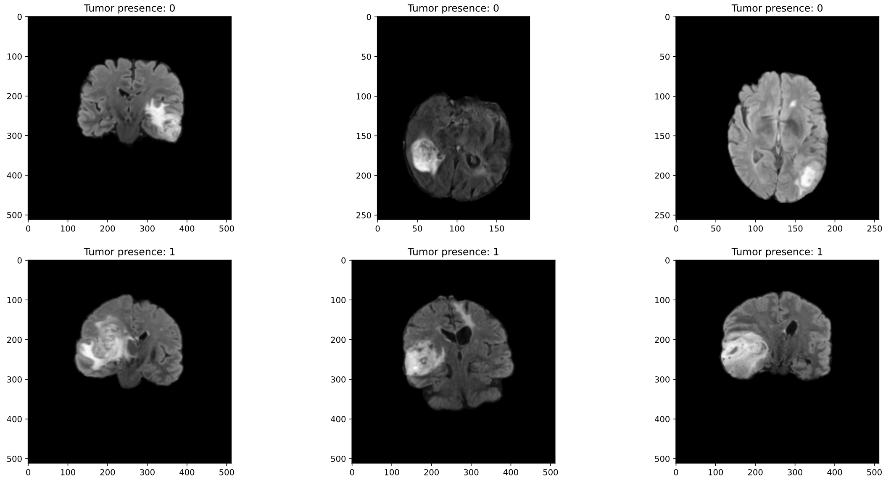
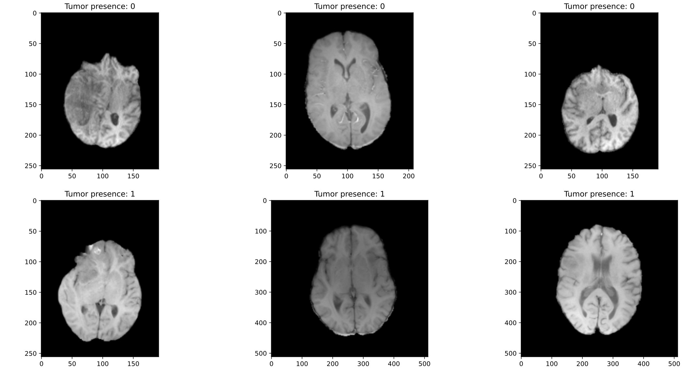
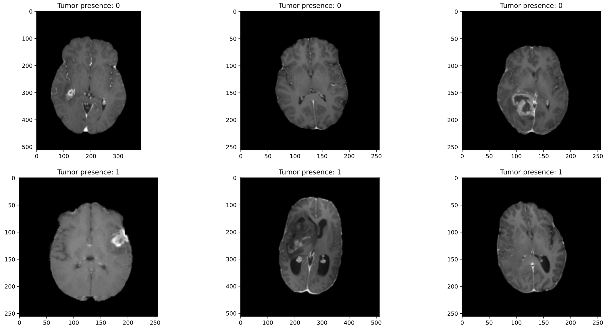
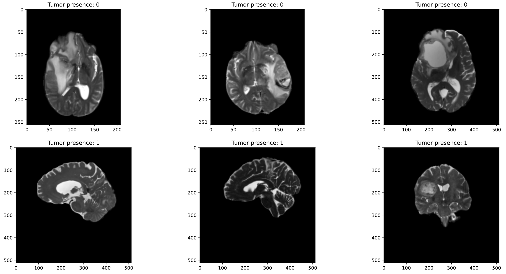
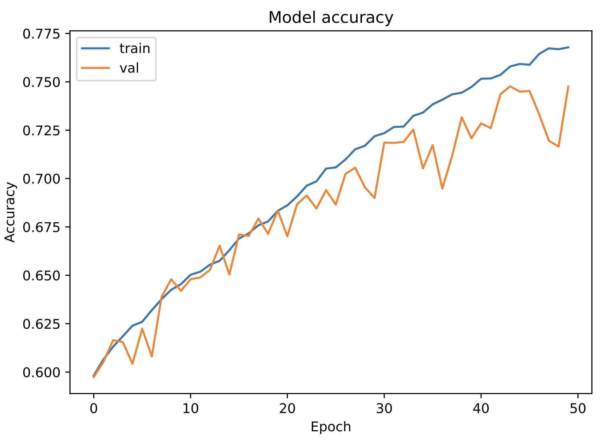
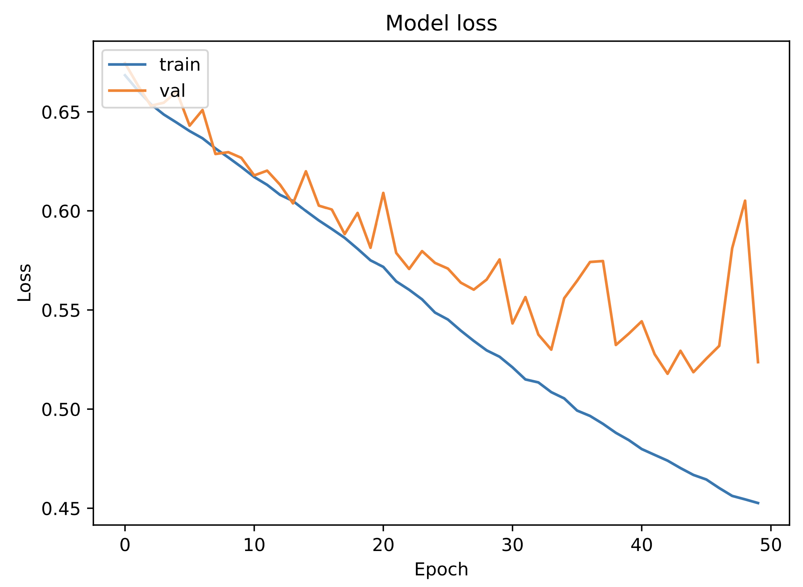

# RSNA-MICCAI Brain Tumor Radiogenomic Classification 🧠👨‍⚕️🤖 
Brain Tumor Radiogenomic Classification task solved by [Mario Lozano Cortés](https://github.com/SrLozano), Artificial Intelligence master's student at _Universitat de Barcelona_ and _Universitat Politècnica de Catalunya · BarcelonaTech - UPC_. The resolution of this task is part of the Deep Learning for Medical Image Analysis subject. The goal of this project is to **predict the status of a genetic biomarker important for brain cancer treatment.**

## Goal of the project 💯
The overarching goal of this [Kaggle](https://www.kaggle.com/competitions/rsna-miccai-brain-tumor-radiogenomic-classification) challenge is to develop a deep-learning-based tool to enable the automated detection of the presence of MGMT promoter methylation using MRI (magnetic resonance imaging) scans.

A malignant tumour in the brain is a life-threatening condition. Known as **glioblastoma, it's both the most common form of brain cancer in adults and the one with the worst prognosis, with median survival being less than a year. The presence of a specific genetic sequence in the tumour known as MGMT promoter methylation has been shown to be a favourable prognostic factor and a strong predictor of responsiveness to chemotherapy.** 

Currently, genetic analysis of cancer requires surgery to extract a tissue sample. Then it can take several weeks to determine the genetic characterization of the tumour. Depending upon the results and type of initial therapy chosen, subsequent surgery may be necessary. **If an accurate method to predict the genetics of cancer through imaging (i.e., radiogenomics) alone could be developed, this would potentially minimize the number of surgeries and refine the type of therapy required.** The introduction of new and customized treatment strategies before surgery has the potential to improve the management, survival, and prospects of patients with brain cancer.

In this Kaggle competition we will predict the genetic subtype of glioblastoma using MRI (magnetic resonance imaging) scans to train and test out model to detect the presence of MGMT promoter methylation. 

The organizers provided the participants with two sets of data, training and test, consisting of MRI images. The images are sorted by patient. For each patient, several images of four different scan types (FLAIR, T1w, T1wCE, T2) are available. The training set contains scans of 1010 patients. 

## Dataset  🗂
Each independent case has a dedicated folder identified by a five-digit number. Within each of these “case” folders, there are four sub-folders, each of them corresponding to each of the structural multi-parametric MRI (mpMRI) scans, in PNG format. The exact mpMRI scans included are:

-   Fluid Attenuated Inversion Recovery (**FLAIR**)
-   T1-weighted pre-contrast (**T1w**)
-   T1-weighted post-contrast (**T1wCE**)
-   T2-weighted (**T2w**)

Fluid Attenuated Inversion Recovery (**FLAIR**)


T1-weighted pre-contrast (**T1w**)


T1-weighted post-contrast (**T1wCE**)


T2-weighted (**T2w**)


As can be seen, **in addition to the lack of data, one of the great difficulties to be faced in this challenge is the lack of uniformity between the images. For the same type of scan, we find images of the brain taken from multiple perspectives (frontal, transversal and lateral)**. This fact complicates the training process and is therefore an obstacle to be overcome.

## Architecture proposed 🏛

**In order to deal with the small number of images found in the given dataset it is decided to use a pre-trained model** previously trained on a large dataset on a large-scale image-classification task. In this way, the training can take advantage of the spatial hierarchy of features learned by the pre-trained model.

The pre-trained model used in this task is VGG16 on the ImageNet dataset (1.4 million labelled images and 1,000 different classes).

The way of using the pre-trained model is **feature extraction.** A technique that consists of using the representations learned by the pre-trained model. Hence, **an image is passed through the convolutional base of VGG16 and a new classifier is trained on top of it.** 

- Learning rate = 0.0005    
- Optimizer = RMSprop
- Batch size = 32
- Loss function = Binary Crossentropy
- patient_mode = "all"    
- image_mode = "FLAIR"    
- Data augmentation = False 

```python
# Build model
base_model = VGG16(include_top=False, input_shape=(224, 224, 3), weights='imagenet')

# Make sure that the base_model is running in inference mode here, by passing `training=False`
base_model.trainable = False

# Define model structure
inputs = keras.Input(shape=(224, 224, 3))
x = base_model(inputs, training=False)

# Convert features to vectors
x = keras.layers.GlobalAveragePooling2D()(x)

# Dense classifier for binary classification
x = keras.layers.Dense(128, activation='relu')(x)
x = keras.layers.Dense(64, activation='relu')(x)
x = keras.layers.Dense(32, activation='relu')(x)
x = keras.layers.Dense(16, activation='relu')(x)
outputs = keras.layers.Dense(1, activation='sigmoid')(x)
model = keras.Model(inputs, outputs)
```

## Run it 🚀

Run *brain-tumor-classification.ipynb* with the Kaggle dataset in order to train the selected model.

## Results 📊

**Accuracy on test set: 0.719**  
**AUC on test set: 0.802**  

This result is considered to be very good taking into account that in the challenge ranking it would have been placed in position 17 of 1556 participants, as can be observed from the [public test data leaderboard](https://www.kaggle.com/competitions/rsna-miccai-brain-tumor-radiogenomic-classification/leaderboard?tab=public).





## Next updates 🔜

Improve performace and generalization

## Issues 🤕

keras model.evaluate and sklearn roc_auc_score give different results. [Stack Overflow](https://stackoverflow.com/questions/74745581/keras-model-evaluate-and-sklearn-roc-auc-score-give-different-results)

## Want to collaborate? 🙋🏻
Feel free to improve and optimize the existing code. To contribute to the project, read the previous points carefully and do the next steps with the project:
1. Fork it (<https://github.com/SrLozano/Brain-Tumor-Radiogenomic-Classification>)
2. Create your feature branch (`git checkout -b feature/Brain-Tumor-Radiogenomic-Classification`)
3. Commit your changes (`git commit -m 'Increased AUC...'`)
4. Push to the branch (`git push origin feature/Brain-Tumor-Radiogenomic-Classification`)
5. Create a new Pull Request

## Need help ❓
Feel free to contact the developer if you have any questions or suggestions about the project or how you can help with it.

## Acknowledgments

[Kaggle Challenge](https://www.kaggle.com/competitions/rsna-miccai-brain-tumor-radiogenomic-classification)

**The Radiological Society of North America (RSNA®)** is a non-profit organization that represents 31 radiologic subspecialties from 145 countries around the world. RSNA promotes excellence in patient care and health care delivery through education, research and technological innovation.

RSNA provides high-quality educational resources, publishes five top peer-reviewed journals, hosts the world’s largest radiology conference and is dedicated to building the future of the profession through the RSNA Research & Education (R&E) Foundation, which has funded $66 million in grants since its inception. RSNA also supports and facilitates artificial intelligence (AI) research in medical imaging by sponsoring an ongoing series of AI challenge competitions.

**The Medical Image Computing and Computer Assisted Intervention Society (the MICCAI Society)** is dedicated to the promotion, preservation and facilitation of research, education and practice in the field of medical image computing and computer assisted medical interventions including biomedical imaging and medical robotics. The Society achieves this aim through the organization and operation of annual high quality international conferences, workshops, tutorials and publications that promote and foster the exchange and dissemination of advanced knowledge, expertise and experience in the field produced by leading institutions and outstanding scientists, physicians and educators around the world.
